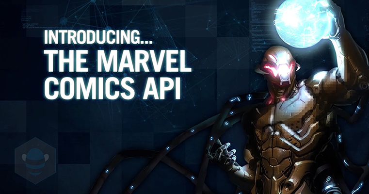

# 🛡️ Marvel API Tests - Postman Automation




 

Este repositório contém uma **suíte de testes automatizados de API** para o endpoint `/characters` da **Marvel Comics API**, desenvolvida utilizando o **Postman** e executada via **Newman** no **GitHub Actions**. O objetivo é garantir a qualidade, a integridade dos dados e o tratamento adequado de diferentes cenários de requisição e erros.

## ✨ Funcionalidades Testadas

Os testes automatizados cobrem os seguintes cenários para o endpoint `/characters`:

### 1. **Consulta Básica de Personagens**
- Listagem bem-sucedida de personagens com autenticação válida.
- Verificação do Status Code `200 OK`.
- Validação da estrutura básica da resposta (presença de `data`, `results`, `total`).
- Checagem da presença de dados essenciais em um personagem (ex: `id`, `name`, `description`).

### 2. **Filtros e Busca por Nome**
- Busca de personagens pelo prefixo do nome (`nameStartsWith`).
- Validação de que os resultados retornados correspondem ao filtro.
- Verificação de cenários onde nenhum resultado é encontrado.

### 3. **Paginação (Limit e Offset)**
- Controle da quantidade de resultados por página (`limit`).
- Navegação entre as páginas de resultados (`offset`).
- Validação de que o número de itens retornados e o total correspondem à paginação.

### 4. **Limites de Requisição Inválidos**
- Verificação do comportamento da API ao solicitar um `limit` acima do permitido.
- Validação do Status Code de erro (`409 Conflict` ou similar).
- Checagem da mensagem de erro esperada.

### 5. **Autenticação Inválida**
- Testes para requisições sem `apikey` ou com `apikey` inválida.
- Validação do Status Code `401 Unauthorized`.
- Checagem das mensagens de erro específicas (`InvalidCredentials`, `The passed API key is invalid.`).

---

## 🛠️ Tecnologias Utilizadas

* **Postman**: Ferramenta de desenvolvimento e teste de APIs.
* **JavaScript**: Linguagem utilizada nos scripts de pré-requisição e testes do Postman.
* **Node.js**: Ambiente de execução necessário para o Newman e npm.
* **npm**: Gerenciador de pacotes para instalação do Newman.
* **Newman**: Ferramenta de linha de comando para rodar coleções do Postman.
* **GitHub Actions**: Serviço de CI/CD para automação da execução dos testes.

## 🚀 Como Rodar os Testes

### Pré-requisitos

Certifique-se de ter:
* [Node.js](https://nodejs.org/) (versão 18 ou superior recomendada) e `npm` (que vem com o Node.js) instalados.
* Uma conta e chaves de API da Marvel (uma `publicKey` e uma `privateKey`) obtidas em [developer.marvel.com](https://developer.marvel.com/).

### 1. Configuração do Repositório Local

1.  **Clone este repositório:**
    ```bash
    git clone [https://github.com/WarleyZucoloto/Test_API_Marvel.git](https://github.com/WarleyZucoloto/Test_API_Marvel.git)
    cd Test_API_Marvel
    ```
2.  **Crie o arquivo `.gitignore`:**
    * Na raiz do repositório, crie um arquivo chamado `.gitignore`.
    * Adicione a seguinte linha para evitar o envio de credenciais sensíveis:
        ```
        # .gitignore
        *.postman_environment.json
        ```

### 2. Configuração do Ambiente no Postman (Local)

Para rodar os testes localmente no Postman GUI:

1.  **Importe a Coleção:**
    * Abra o Postman.
    * Clique em "Import" e selecione o arquivo `Meus Testes com API Marvel.postman_collection.json` que está na raiz do seu repositório clonado.
2.  **Crie e Configure um Ambiente:**
    * No Postman, vá em "Environments" (ou no ícone de engrenagem no canto superior direito).
    * Clique em "Add" ou "Manage Environments" > "Add".
    * Dê um nome ao ambiente (ex: "Marvel API Keys Local").
    * Adicione as seguintes variáveis (com seus respectivos valores reais das chaves da Marvel):
        * `publicKey`: Sua **chave pública** da Marvel API.
        * `privateKey`: Sua **chave privada** da Marvel API.
        * `baseUrl`: `https://gateway.marvel.com/v1/public/`
        * `ts`: (Deixe vazio ou com um placeholder, será gerado automaticamente pelo Pre-request Script).
        * `hash`: (Deixe vazio ou com um placeholder, será gerado automaticamente pelo Pre-request Script).
    * **Selecione** este ambiente recém-criado no menu suspenso de ambientes do Postman antes de rodar qualquer request ou coleção.

### 3. Executando os Testes Localmente (Postman GUI ou Newman CLI)

* **Via Postman GUI:**
    1.  Certifique-se de ter o ambiente "Marvel API Keys Local" selecionado.
    2.  Vá na sua coleção importada (`Meus Testes com API Marvel`).
    3.  Clique nos três pontinhos (...) ao lado da coleção e selecione "Run collection".
    4.  Visualize os resultados diretamente no Test Runner do Postman.

* **Via Newman CLI (linha de comando):**
    1.  Abra seu terminal (Git Bash, CMD, PowerShell) na raiz do repositório.
    2.  Instale o Newman globalmente:
        ```bash
        npm install -g newman
        ```
    3.  **Exporte seu ambiente do Postman (com suas chaves preenchidas) para a mesma pasta:**
        * No Postman, vá na engrenagem "Manage Environments".
        * Ao lado do seu ambiente "Marvel API Keys Local", clique nos três pontinhos (...) e "Export".
        * Salve como `API-Marvel-Keys.postman_environment.json` (ou o nome que preferir) na raiz do seu repositório local. **Lembre-se que este arquivo não deve ser commitado para o Git!**
    4.  Execute a coleção usando Newman, passando o arquivo de ambiente:
        ```bash
        newman run "Meus Testes com API Marvel.postman_collection.json" -e "API-Marvel-Keys.postman_environment.json"
        ```

### 4. Executando os Testes com GitHub Actions (CI/CD)

Os testes são configurados para serem executados automaticamente no GitHub Actions, garantindo a validação contínua da API sem expor suas credenciais.

1.  **Configure os Segredos no GitHub:**
    * No seu repositório GitHub, vá em **"Settings" > "Secrets and variables" > "Actions"**.
    * Crie os seguintes "New repository secret":
        * `MARVEL_PUBLIC_KEY` (com sua chave pública da Marvel)
        * `MARVEL_PRIVATE_KEY` (com sua chave privada da Marvel)
        * `MARVEL_BASE_URL` (com o valor `https://gateway.marvel.com/v1/public/`)
2.  **O Workflow (`.github/workflows/Marvel-API-Tests.yml`):**
    * O workflow já está configurado no arquivo `.github/workflows/Marvel-API-Tests.yml` para instalar o Newman e rodar sua coleção.
    * Ele injeta os valores dos segredos do GitHub (`MARVEL_PUBLIC_KEY`, `MARVEL_PRIVATE_KEY`, `MARVEL_BASE_URL`) diretamente no Newman via `--env-var`, garantindo que suas credenciais nunca sejam expostas no código do repositório.
3.  **Execução Automática:**
    * O workflow será disparado automaticamente a cada `push` para a branch `main` e a cada `pull_request` aberto para a `main`.
4.  **Ver os Resultados:**
    * Acompanhe o status e os logs das execuções na aba **"Actions"** do seu repositório no GitHub.

## 📁 Estrutura do Projeto

* `.github/workflows/`: Contém os arquivos de configuração do GitHub Actions (`.yml`).
* `Meus Testes com API Marvel.postman_collection.json`: O arquivo principal da coleção Postman com todos os requests e testes.
* `API-Marvel-Keys.postman_environment.json`: (Este arquivo é gerado e usado localmente, **ignorado pelo Git** para proteger credenciais).
* `.gitignore`: Arquivo de configuração do Git para ignorar arquivos específicos (como o ambiente Postman).
* `README.md`: Este arquivo de documentação do projeto.

## 🤝 Contribuições

Contribuições são bem-vindas! Sinta-se à vontade para abrir issues ou pull requests.

## 📄 Licença

Este projeto está sob a licença MIT.

## 📞 Contato

* **Nome:** Warley Zucoloto
* **LinkedIn:** [https://www.linkedin.com/in/warleydomingueszucoloto](https://www.linkedin.com/in/warleydomingueszucoloto)
* **GitHub:** [https://github.com/WarleyZucoloto](https://github.com/WarleyZucoloto)